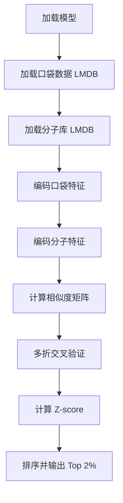

# DrugCLIP 使用指南

> **提示**: 如需使用更大的分子库（如 ZINC、Enamine REAL 等），请参考 [LARGE_DATABASE_GUIDE.md](LARGE_DATABASE_GUIDE.md)

## 一、`retrieval.sh` 脚本功能解析

### 脚本作用
`retrieval.sh` 是 DrugCLIP 的**虚拟筛选（Virtual Screening）**脚本，用于：
1. 从大型分子库（如 ChemDIV，包含 1648137 个分子）中筛选出与目标蛋白口袋（pocket）最匹配的配体
2. 使用 DrugCLIP 模型计算分子和蛋白口袋的相似度分数
3. 输出排名前 2% 的候选分子及其分数

### 工作流程



### 关键参数说明

```bash
MOL_PATH="mols.lmdb"                    # 分子库路径（预编码的分子嵌入）
POCKET_PATH="./data/targets/NET/pocket.lmdb"  # 目标蛋白口袋路径
FOLD_VERSION="6_folds"                  # 交叉验证折数（5HT2A 需要 8_folds）
use_cache=True                          # 使用预编码的分子嵌入（推荐）
save_path="NET.txt"                     # 输出结果文件
```

### 输出格式
结果文件 `NET.txt` 每行格式：
```
SMILES,score
CCO,2.345
CCN,2.123
...
```

---

## 二、使用新的 PDB 文件进行配体筛选

### 完整流程

#### 步骤 1: 准备 PDB 文件

PDB 文件要求：
- 包含蛋白结构和配体（ligand）
- 配体残基名需要与文件名匹配（见步骤 2）
- 例如：`protein_LIG.pdb`，其中 `LIG` 是配体残基名

#### 步骤 2: 创建口袋目录并放置 PDB 文件

```bash
# 创建新目标目录
mkdir -p /shared/healthinfolab/phz24002/DrugClip/data/targets/MY_TARGET

# 将 PDB 文件放入该目录
# 文件名格式：{pdb_id}_{ligand_name}.pdb
# 例如：1abc_ADP.pdb（配体残基名为 ADP）
cp your_protein.pdb /shared/healthinfolab/phz24002/DrugClip/data/targets/MY_TARGET/
```

#### 步骤 3: 从 PDB 文件生成 pocket.lmdb

使用 `encode_pocket.sh` 脚本：

```bash
cd /shared/healthinfolab/phz24002/DrugClip

# 激活环境
source /shared/healthinfolab/phz24002/anaconda3/bin/activate drugclip

# 运行编码脚本
# 参数1: GPU设备号（0）
# 参数2: 口袋目录路径
bash encode_pocket.sh 0 ./data/targets/MY_TARGET
```

**脚本功能：**
1. 从 PDB 文件中提取配体结合口袋（距离配体 ≤ 6Å 的残基）
2. 将口袋信息转换为 LMDB 格式（`pocket.lmdb`）
3. 使用 DrugCLIP 模型编码口袋特征（`pocket_reps.pkl`）

#### 步骤 4: 配置 retrieval.sh

编辑 `retrieval.sh`：

```bash
POCKET_PATH="./data/targets/MY_TARGET/pocket.lmdb"
save_path="MY_TARGET_results.txt"
FOLD_VERSION="6_folds"  # 或根据目标调整
```

#### 步骤 5: 运行虚拟筛选

```bash
bash retrieval.sh
```

---

## 三、详细示例：处理新的 PDB 文件

### 示例：筛选针对新蛋白的配体

假设您有一个新的 PDB 文件 `myprotein_ADP.pdb`：

```bash
# 1. 创建目标目录
mkdir -p /shared/healthinfolab/phz24002/DrugClip/data/targets/MYPROTEIN

# 2. 复制 PDB 文件
cp myprotein_ADP.pdb /shared/healthinfolab/phz24002/DrugClip/data/targets/MYPROTEIN/

# 3. 激活环境
source /shared/healthinfolab/phz24002/anaconda3/bin/activate drugclip
cd /shared/healthinfolab/phz24002/DrugClip

# 4. 编码口袋（在 GPU 节点上）
ssh gpu28
source /shared/healthinfolab/phz24002/anaconda3/bin/activate drugclip
cd /shared/healthinfolab/phz24002/DrugClip
bash encode_pocket.sh 0 ./data/targets/MYPROTEIN

# 5. 检查生成的文件
ls -lh ./data/targets/MYPROTEIN/
# 应该看到：
# - pocket.lmdb          # 口袋数据
# - pocket_reps.pkl      # 口袋特征表示

# 6. 修改 retrieval.sh
# 编辑 POCKET_PATH 和 save_path

# 7. 运行筛选
bash retrieval.sh
```

---

## 四、代码工作原理详解

### 1. 口袋提取（`encode_pockets.py`）

```python
# 从 PDB 文件中提取口袋
def get_binding_pockets(biopy_chain, liglist):
    pockets = []
    for n, lig in liglist:
        lig_coord = np.array([i.coord for i in lig.get_atoms() if i.element!='H'])
        # 找到距离配体 ≤ 6Å 的所有残基
        for res in biopy_chain:
            res_coord = np.array([i.get_coord() for i in res.get_atoms()])
            dist = np.linalg.norm(res_coord[:,None,:]-lig_coord[None,:,:],axis=-1).min()
            if dist <= 6:  # 6Å 阈值
                tmp_chain.add(res.copy())
        pockets.append((n, tmp_chain))
    return pockets
```

### 2. 虚拟筛选（`retrieval.py`）

核心流程：

1. **加载模型**：加载预训练的 DrugCLIP 模型
2. **编码口袋**：将口袋结构编码为特征向量
3. **编码分子**：
   - 如果 `use_cache=True`：使用预编码的分子嵌入（`encoded_mol_embs/`）
   - 否则：从 `MOL_PATH` 实时编码
4. **计算相似度**：使用余弦相似度计算口袋-分子匹配分数
5. **多折交叉验证**：使用多个模型折（folds）提高鲁棒性
6. **Z-score 标准化**：对分数进行标准化
7. **排序输出**：输出 Top 2% 的候选分子

### 3. 相似度计算

```python
# 口袋和分子的特征向量都是 128 维
pocket_emb = model.pocket_project(pocket_encoder_rep)  # [batch, 128]
mol_emb = model.mol_project(mol_encoder_rep)            # [batch, 128]

# L2 归一化
pocket_emb = pocket_emb / pocket_emb.norm(dim=-1, keepdim=True)
mol_emb = mol_emb / mol_emb.norm(dim=-1, keepdim=True)

# 计算相似度矩阵（余弦相似度）
similarity = pocket_reps @ mol_reps.T  # [n_pockets, n_molecules]
```

---

## 五、常见问题

### Q1: 如何知道应该使用多少折（folds）？

- 大多数目标使用 `6_folds`
- **5HT2A 必须使用 `8_folds`**（README 中明确说明）
- 其他目标可以尝试 `6_folds`，如果结果不理想可以尝试 `8_folds`

### Q2: 如果没有预编码的分子库怎么办？

如果 `use_cache=False`，需要提供 `MOL_PATH` 指向包含 SMILES 的 LMDB 文件。

### Q3: 如何批量处理多个 PDB 文件？

将多个 PDB 文件放在同一个目录下，`encode_pocket.sh` 会自动处理所有 `.pdb` 文件：

```bash
# 目录结构
MY_TARGET/
  ├── 1abc_ADP.pdb
  ├── 2def_ATP.pdb
  └── 3ghi_ADP.pdb

# 运行编码
bash encode_pocket.sh 0 ./data/targets/MY_TARGET
# 会生成包含所有口袋的 pocket.lmdb
```

### Q4: 如何只使用特定的口袋？

编辑生成的 `pocket.lmdb` 或修改代码来筛选特定的口袋。

### Q5: 结果文件中的分数含义？

- 分数越高，表示分子与口袋的匹配度越高
- 分数经过 Z-score 标准化，便于比较
- 通常关注 Top 1-2% 的候选分子

---

## 六、完整工作流示例脚本

创建一个新的筛选任务：

```bash
#!/bin/bash
# 新目标筛选脚本

TARGET_NAME="MY_NEW_TARGET"
PDB_DIR="./data/targets/${TARGET_NAME}"
GPU_ID=0

# 1. 创建目录
mkdir -p ${PDB_DIR}

# 2. 复制 PDB 文件（假设已准备好）
# cp your_files/*.pdb ${PDB_DIR}/

# 3. 编码口袋
echo "编码口袋..."
bash encode_pocket.sh ${GPU_ID} ${PDB_DIR}

# 4. 运行筛选
echo "运行虚拟筛选..."
# 修改 retrieval.sh 中的参数，或直接运行：
CUDA_VISIBLE_DEVICES=${GPU_ID} python ./unimol/retrieval.py \
    --user-dir ./unimol \
    --data "./dict" \
    --valid-subset test \
    --num-workers 8 \
    --ddp-backend=c10d \
    --batch-size 4 \
    --task drugclip \
    --loss in_batch_softmax \
    --arch drugclip \
    --max-pocket-atoms 511 \
    --fp16 \
    --fp16-init-scale 4 \
    --fp16-scale-window 256 \
    --seed 1 \
    --log-interval 100 \
    --log-format simple \
    --mol-path mols.lmdb \
    --pocket-path ${PDB_DIR}/pocket.lmdb \
    --fold-version 6_folds \
    --use-cache True \
    --save-path ${TARGET_NAME}_results.txt

echo "完成！结果保存在 ${TARGET_NAME}_results.txt"
```

---

## 七、性能优化建议

1. **使用预编码的分子库**：`use_cache=True` 可以大幅加速
2. **批量大小**：根据 GPU 内存调整 `--batch-size`
3. **多 GPU**：可以使用多个 GPU 并行处理（需要修改脚本）
4. **内存优化**：对于大型分子库，使用 `screening_chunks.py` 进行分块处理

---

## 八、相关工具

- **Pocket 检测**：https://github.com/THU-ATOM/Pocket-Detection-of-DTWG
- **后处理管道**：https://github.com/THU-ATOM/DrugCLIP_screen_pipeline
- **Pocket 预训练**：https://github.com/THU-ATOM/ProFSA
